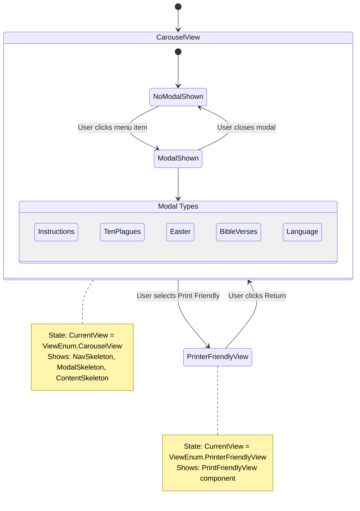
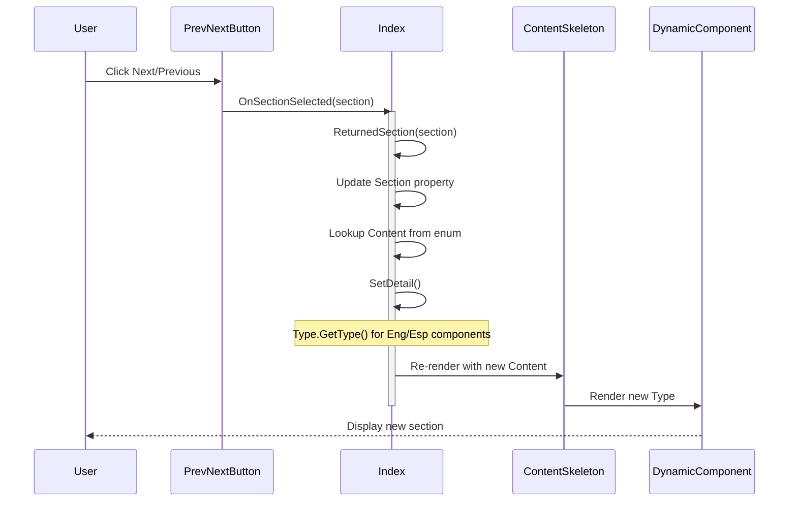
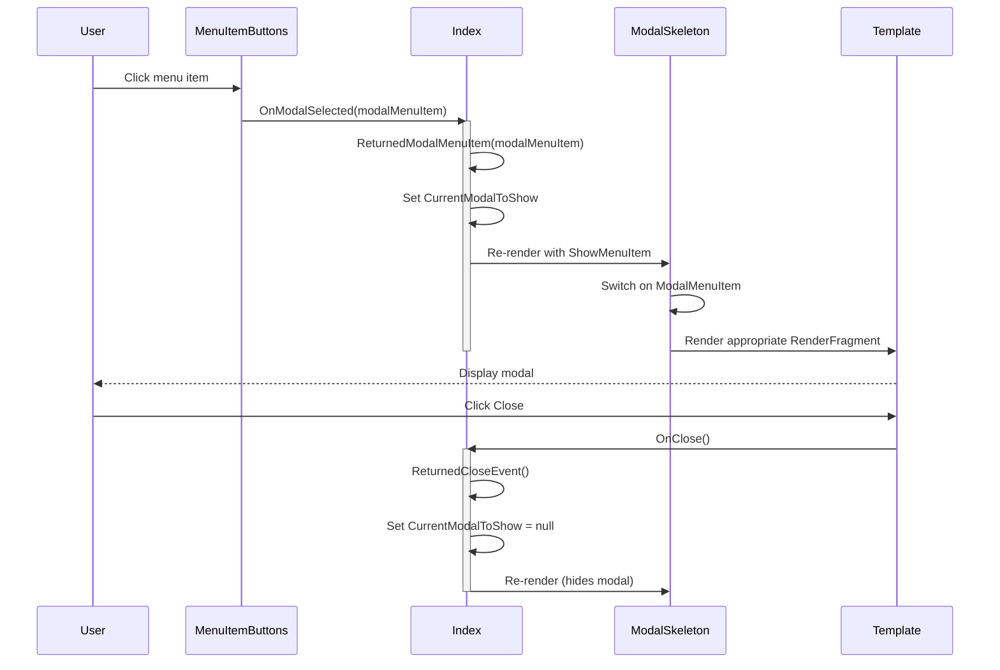
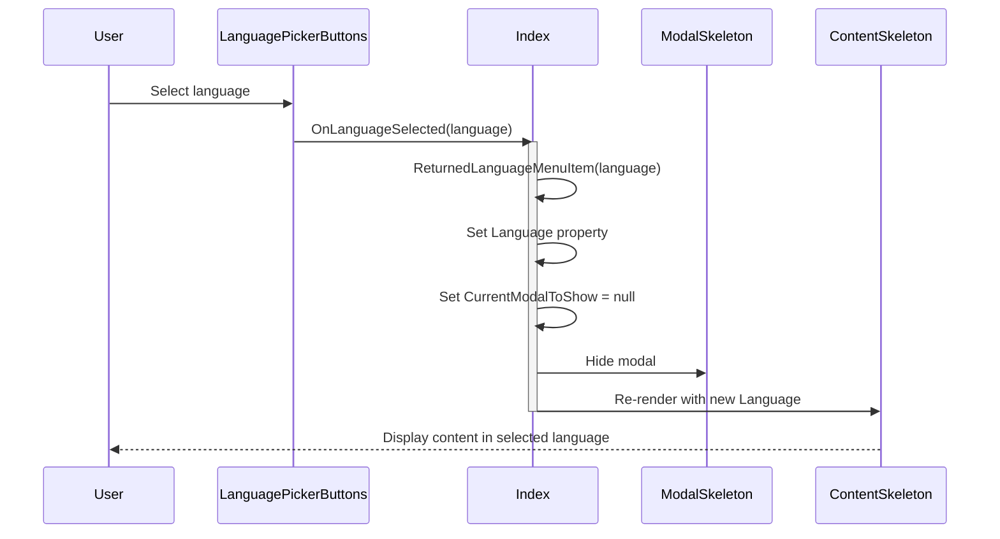

# Haggadah Feature Architecture

## Overview

The Haggadah feature uses a **Skeleton Pattern** to avoid callback drilling (GrandParent → Parent → Child event chains). All event handling is centralized in `Index.razor`, while layout components ("Skeletons") accept content via `RenderFragment` parameters.

## Component Hierarchy

```mermaid
graph TD
    Index[Index.razor<br/>Parent Component<br/>Centralized EventCallbacks & State]
    
    Index --> NavSkeleton[NavSkeleton.razor<br/>Navigation Bar Layout]
    Index --> ModalSkeleton[ModalSkeleton.razor<br/>Modal Switch Logic]
    Index --> ContentSkeleton[ContentSkeleton.razor<br/>Content Display Layout]
    Index --> PrintFriendly[PrintFriendlyView<br/>Alternate View]
    
    NavSkeleton --> |PrevButtonDivRF| PrevButton[PreviousOrNextButton]
    NavSkeleton --> |ProgressBarDivRF| ProgressBar[Progressbar<br/>Responsive xs/sm & md/lg/xl]
    NavSkeleton --> |NextButtonDivRF| NextButton[PreviousOrNextButton]
    NavSkeleton --> |JustifyEndRF| MenuButtons[MenuItemButtons]
    
    ModalSkeleton --> |InstructionsRF| Instructions[Template: Instructions]
    ModalSkeleton --> |TenPlaguesRF| TenPlagues[Template: Ten Plagues]
    ModalSkeleton --> |EasterRF| Easter[Template: Easter]
    ModalSkeleton --> |BibleVersesRF| BibleVerses[Template: Bible Verses]
    ModalSkeleton --> |LanguageRF| Language[Template: Language Picker]
    
    ContentSkeleton --> |EngBody| EngBody[DynamicComponent<br/>English Content]
    ContentSkeleton --> |EspBody| EspBody[DynamicComponent<br/>Spanish Content]
    
    PrevButton -.->|OnSectionSelected| Index
    NextButton -.->|OnSectionSelected| Index
    MenuButtons -.->|OnModalSelected<br/>OnPrintFriendlySelected| Index
    Language -.->|OnLanguageSelected| Index
    Instructions -.->|OnClose| Index
    TenPlagues -.->|OnClose| Index
    Easter -.->|OnClose| Index
    BibleVerses -.->|OnClose| Index
    PrintFriendly -.->|OnReturn| Index
    
    style Index fill:#e1f5ff,stroke:#0078d4,stroke-width:3px
    style NavSkeleton fill:#fff4e6,stroke:#f7931e,stroke-width:2px
    style ModalSkeleton fill:#fff4e6,stroke:#f7931e,stroke-width:2px
    style ContentSkeleton fill:#fff4e6,stroke:#f7931e,stroke-width:2px
```



## State Management



## Event Flow: Section Navigation



## Event Flow: Modal Interaction



## Event Flow: Language Selection



## Key Components

### Index.razor (Parent/Orchestrator)

**Responsibilities:**
- Centralized state management
- All event callback handling
- View switching logic (Carousel vs Print-Friendly)
- Dynamic component type resolution

**Key State:**
```csharp
protected int Section = 1;
protected Enums.Content? CurrentContent;
protected Enums.DisplayLanguage? Language;
protected Enums.ModalMenuItem? CurrentModalToShow;
protected ViewEnum CurrentView;
protected Type? DetailContentEng;
protected Type? DetailContentEsp;
```

**Key Methods:**
- `ReturnedSection(int)` - Navigation between sections
- `ReturnedModalMenuItem(ModalMenuItem)` - Show modal
- `ReturnedCloseEvent()` - Hide modal
- `ReturnedLanguageMenuItem(DisplayLanguage)` - Change language
- `ReturnedPrintFriendlySelected()` / `ReturnedNormalView()` - View switching
- `SetDetail()` - Dynamic component resolution via reflection

### NavSkeleton.razor (Layout Component)

**Purpose:** Structure the navigation bar without business logic

**RenderFragment Parameters:**
- `PrevButtonDivRF` - Previous button slot
- `ProgressBarDivRF` - Progress bar slot (responsive)
- `NextButtonDivRF` - Next button slot
- `JustifyEndRF` - Menu buttons slot

### ModalSkeleton.razor (Layout Component)

**Purpose:** Switch between different modal types based on state

**RenderFragment Parameters:**
- `InstructionsRF` - Instructions modal
- `TenPlaguesRF` - Ten Plagues appendix
- `EasterRF` - Easter appendix
- `BibleVersesRF` - Bible verses appendix
- `LanguageRF` - Language picker

**Logic:** Uses switch statement on `ShowMenuItem` parameter to render appropriate modal

### ContentSkeleton.razor (Layout Component)

**Purpose:** Display content with language switching

**Parameters:**
- `Content` - Content enum with titles
- `Language` - Current display language
- `EngBody` / `EspBody` - RenderFragments for language-specific content

**Logic:** Conditionally renders English or Spanish based on `Language` parameter

## Design Principles

### 1. Skeleton Pattern
Skeleton components are pure layout containers:
- No business logic
- No direct event handlers
- Accept content via `RenderFragment` parameters
- Minimal display logic (e.g., language selection, switch statements)

### 2. Centralized Event Handling
All EventCallbacks are handled in `Index.razor`:
- ✅ Avoids callback drilling through component hierarchy
- ✅ Single source of truth for state
- ✅ Easier debugging and maintenance
- ✅ Clear data flow

### 3. Composition Over Inheritance
Components are composed using RenderFragments:
```razor
<NavSkeleton>
    <PrevButtonDivRF>
        <PreviousOrNextButton OnSectionSelected="ReturnedSection" />
    </PrevButtonDivRF>
</NavSkeleton>
```

### 4. Dynamic Component Loading
Content components are resolved at runtime:
```csharp
DetailContentEng = Type.GetType($"{Constants.DynamicComponentPathEng}.{CurrentContent!.Name}");
```

## Naming Conventions

### Skeleton Suffix
Components ending in `*Skeleton` indicate:
- Layout/structural components
- Accept RenderFragment parameters
- Minimal or no business logic

### RenderFragment Suffix
Parameters ending in `RF` indicate RenderFragment parameters:
- `PrevButtonDivRF`
- `ProgressBarDivRF`
- `InstructionsRF`

### Returned Prefix
Methods starting with `Returned*` are EventCallback handlers:
- `ReturnedSection` - Handles section navigation
- `ReturnedModalMenuItem` - Handles modal open
- `ReturnedCloseEvent` - Handles modal close

## Alternative Patterns Considered

### ❌ Callback Drilling (Not Used)
```razor
<!-- Anti-pattern: Event bubbling through hierarchy -->
<GrandParent OnEvent="HandleEvent">
  <Parent OnEvent="@((e) => OnEvent.InvokeAsync(e))">
    <Child OnEvent="@((e) => OnEvent.InvokeAsync(e))" />
  </Parent>
</GrandParent>
```
**Why avoided:** Causes tight coupling, difficult debugging, verbose code

### ❌ Cascading Parameters (Not Needed Here)
```razor
<CascadingValue Value="state">
    <!-- Deep hierarchy -->
</CascadingValue>
```
**Why not used:** Overkill for this scope; centralized state in parent is sufficient

### ✅ Skeleton + RenderFragment (Chosen)
```razor
<Skeleton>
    <ContentSlot>
        <ChildComponent OnEvent="ParentHandler" />
    </ContentSlot>
</Skeleton>
```
**Why chosen:** Clean separation, no callback drilling, explicit data flow

## Future Considerations

If `Index.razor` grows too large:
1. **Partial Classes:** Move code to `Index.razor.cs`
2. **Feature Services:** Extract complex logic to injected services
3. **State Management:** Consider Fluxor for app-wide state
4. **Split Features:** Break into smaller parent components per feature area

## Related Documentation
- [Template Component](./Toolbar/Modal/Template.razor) - Modal wrapper component
- [DynamicComponent Documentation](https://learn.microsoft.com/en-us/aspnet/core/blazor/components/dynamiccomponent)
- [RenderFragment Documentation](https://learn.microsoft.com/en-us/aspnet/core/blazor/components/#child-content-render-fragments)
