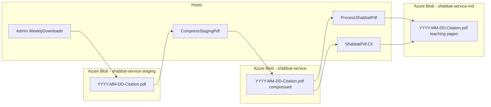
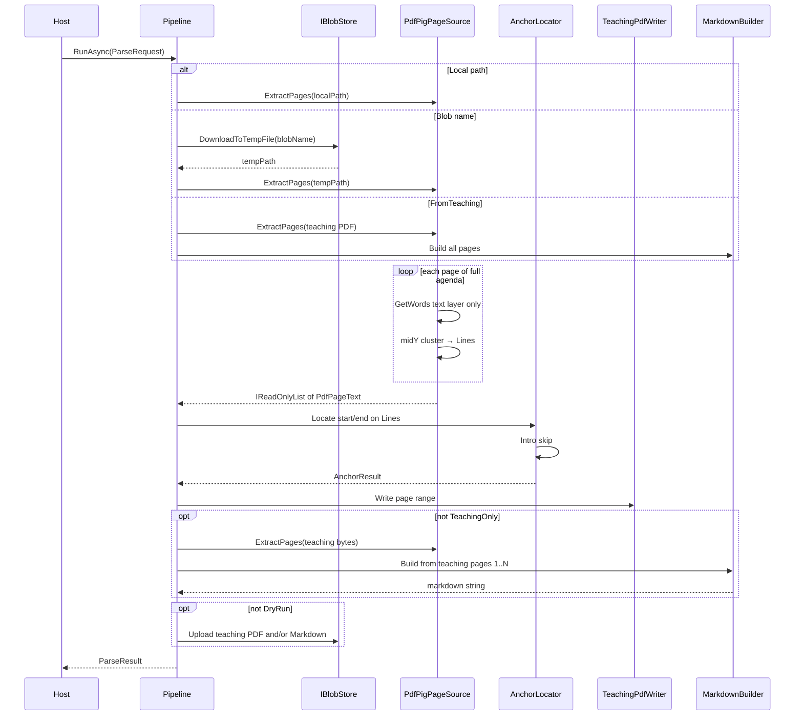
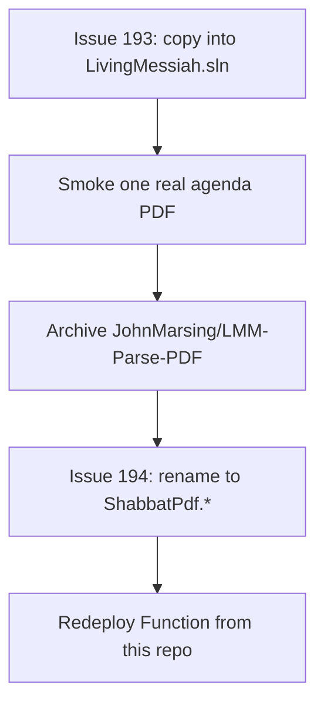

# LMM Parse PDF → Markdown (ShabbatPdf)

| Field | Value |
|-------|-------|
| **Author** | John Marsing |
| **Original date** | 2026-07-10 |
| **Updated** | 2026-08-31 |
| **Status** | **Implemented** in the LivingMessiah monorepo. Blob chain: staging → compress → teaching PDF (same name). |
| **Repo (source of truth)** | https://github.com/LivingMessiahJohn/LivingMessiah |
| **Product folder** | `ShabbatPdf/` |
| **Workspace** | `C:\Source\repos\LivingMessiah` |
| **Solution** | `LivingMessiah.sln` (projects `ShabbatPdf.Core`, `ShabbatPdf.Cli`, `ShabbatPdf.Functions`, `ShabbatPdf.Tests`) |
| **Historical repo** | https://github.com/JohnMarsing/LMM-Parse-PDF — **archived 2026-08-04**; do not deploy from it |

This document is the as-built design for the Shabbat agenda parse pipeline. Extraction rules (anchors, intro skip, text-layer Markdown) are the original v1 contract. What changed after ship is **where the code lives** and **what the assemblies are named**.

| Issue | What it did |
|-------|-------------|
| [#193](https://github.com/LivingMessiahJohn/LivingMessiah/issues/193) | Copied LMM-Parse-PDF into this monorepo (not a submodule, not into `Api/`). Deploy and local work use the LivingMessiah GitHub/Azure identity. Old repo archived. |
| [#194](https://github.com/LivingMessiahJohn/LivingMessiah/issues/194) | Renamed `LivingMessiah.ShabbatPdf.*` projects, assemblies, and namespaces to `ShabbatPdf.*`. CLI and Function behavior unchanged. |

Operator how-to (CLI flags, deploy script, Ghostscript app settings) lives in [`ShabbatPdf/README.md`](../README.md). This file is the design contract.

---

## Home, naming, and cutover (#193 / #194)

### Why the code moved (#193)

LMM-Parse-PDF was Living Messiah Shabbat pipeline code, but it lived under `JohnMarsing/LMM-Parse-PDF` (MHB-oriented GitHub/Azure login). That split auth, deploy, and day-to-day work from `LivingMessiahJohn/LivingMessiah` even though:

- Storage is already `livingmessiahstorage`
- Consumers (PWA teaching PDFs) are already Living Messiah
- The Function app `lmm-shabbat-pdf` is in resource group `LmmWebAppGroup`

**Goal:** source of truth and deploy path live in this monorepo. Same GitHub and Azure identity as the rest of LivingMessiah.

**Not the goal:** merge into the PWA `Api/` Functions project, move storage accounts, redesign anchors, or add OCR / image export.

### What shipped for #193

- `ShabbatPdf/` copied into the monorepo (not a git submodule)
- Projects referenced from `LivingMessiah.sln`
- Secrets via user-secrets / Function App Settings / `local.settings.json.example` (no real `local.settings.json` committed)
- Deploy from `ShabbatPdf/scripts/deploy-function.ps1` to the **existing** Function app `lmm-shabbat-pdf` (lowest-risk cutover; no new Function app)
- Smoke path unchanged: upload a full agenda PDF to `shabbat-service` → `*-teaching.pdf` + `.md`
- Old repo archived and marked read-only; banner points here
- Aspire local Function parity **not** required for cutover and is still not wired in `LivingMessiah.AppHost`

### Why names shortened (#194)

After the port, project names `LivingMessiah.ShabbatPdf.Cli`, `.Core`, `.Functions`, and `.Tests` duplicated the folder already named `ShabbatPdf/`. Other monorepo projects use short names (`Api`, `Admin`). #194 made project, assembly, namespace, and script paths consistently `ShabbatPdf.*`.

User-secrets stay on the CLI `UserSecretsId` (`55d9f8ea-37ff-4a29-8b16-1dc8b9fc5ed2`), which did **not** change with the project rename.

### Naming map (locked)

| Role | Before (#193 port, old repo) | After (#194) |
|------|------------------------------|--------------|
| Core library | `LivingMessiah.ShabbatPdf.Core` | `ShabbatPdf.Core` |
| Console CLI | `LivingMessiah.ShabbatPdf.Cli` | `ShabbatPdf.Cli` |
| Azure Function host | `LivingMessiah.ShabbatPdf.Functions` | `ShabbatPdf.Functions` |
| Tests | `LivingMessiah.ShabbatPdf.Tests` | `ShabbatPdf.Tests` |
| Namespaces | `LivingMessiah.ShabbatPdf.*` | `ShabbatPdf.Core.*`, `ShabbatPdf.Cli`, `ShabbatPdf.Functions`, `ShabbatPdf.Tests.*` |
| Function published DLL | `LivingMessiah.ShabbatPdf.Functions.dll` | `ShabbatPdf.Functions.dll` |
| CLI run (from solution root) | `dotnet run --project src/LivingMessiah.ShabbatPdf.Cli` | `dotnet run --project ShabbatPdf\src\Cli` |
| Deploy project | `src/LivingMessiah.ShabbatPdf.Functions/...` | `src/Functions/ShabbatPdf.Functions.csproj` |
| Markdown front matter `tool:` | `LMM-Parse-PDF` | **Unchanged** (`MarkdownBuilder.ToolName`) — product label, not an assembly name |

Do **not** mix old and new namespaces. Do **not** put this code in `Api/`.

### Dual-deploy rule

Only `LivingMessiahJohn/LivingMessiah` deploys `lmm-shabbat-pdf`. The archived repo must not push to that app.

---

## Overview

Every Saturday, Living Messiah Ministries produces a multi-page Shabbat service agenda PDF. Admin uploads it to Azure Blob Storage **`shabbat-service-staging`**. Two backend processes then run:

1. **Compress** the PDF (Ghostscript if over 65 MB, otherwise copy) and save it to **`shabbat-service`** with the **same file name** (public Current Service download).
2. **Extract** the teaching-only page range from that compressed PDF and save it to **`shabbat-service-md`** with the **same file name** (no `-teaching` suffix). Markdown is local-CLI optional, not part of this Azure path.

Bounds: start after the bilingual “Welcome / Bienvenido” slide, **skip known intro slides** (Fair Use / “What will we talk about today?”), stop before “The Avinu Prayer”.

This is a **small .NET 8 (`net8.0` LTS) product** under `ShabbatPdf/`:

| Piece | Role |
|-------|------|
| `ShabbatPdf.Core` | PDF text extract, anchors, teaching slice, Markdown, blob I/O, optional Ghostscript shrink helpers |
| `ShabbatPdf.Cli` | Manual / batch host (`--input` or `--blob`) |
| `ShabbatPdf.Functions` | Production hosts: `CompressStagingPdf` (staging → service) and `ProcessShabbatPdf` (service → teaching PDF) |
| `ShabbatPdf.Tests` | xUnit, no live Azure required |

Load is ~1 PDF per week; **simplicity beats scale**.

**Markdown extracts only the PDF text layer** (words PdfPig can read as text). Text that exists only as pixels inside images is **not** extracted (no OCR). **Images themselves are skipped in Markdown**; the teaching PDF **does** keep the visual pages (including images) via PdfPig page import.

**Layout recovery (multi-column / two-column reordering) is out of scope.** Pages are normalized with a simple full-page line cluster (word midY → lines left-to-right, top-to-bottom). That is enough for anchors and for decks whose teaching content is real text. Prefer validating and building goldens against agendas that hold scripture/commentary as selectable text — not primarily as screenshots.

---

## Background & Motivation

### Current state

| Item | Detail |
|------|--------|
| Staging container | `https://livingmessiahstorage.blob.core.windows.net/shabbat-service-staging/` |
| Service container | `https://livingmessiahstorage.blob.core.windows.net/shabbat-service/` |
| Teaching container | `https://livingmessiahstorage.blob.core.windows.net/shabbat-service-md/` |
| Agenda naming | `YYYY-MM-DD-{TorahCitation}.pdf` (same name in all three containers) |
| Teaching PDF | Same file name in `shabbat-service-md` (page slice only) |
| Markdown | Local CLI `--output` only; not written by the Azure functions |
| Example | staging `2026-07-04-Lev-16.pdf` → service `2026-07-04-Lev-16.pdf` → teaching `shabbat-service-md/2026-07-04-Lev-16.pdf` |
| Upload path today | Living Messiah Admin / RCL already uploads PDFs via `AzureBlobService` |
| Function app | `lmm-shabbat-pdf` in `LmmWebAppGroup` (Flex Consumption, West US) |
| Home | `ShabbatPdf/` in this monorepo (#193); short `ShabbatPdf.*` names (#194) |

### Pain points

1. **Agenda PDFs are presentation decks**, not clean books: liturgy, songs, Torah slides, teaching notes, images, closing prayers.
2. **Only the middle “teaching block” is wanted** for Markdown reuse and for a smaller teaching PDF.
3. **Manual copy/paste from PDF is slow** and error-prone; happens weekly.
4. **Files can be large** (observed ~7–250+ MB) — workers must tolerate download + parse cost, not high QPS. Mobile download needs the **full service PDF under 65 MB**.
5. **Some decks embed teaching as images** (text painted into pictures). Markdown will **not** OCR those; operators should know MD only reflects real text-layer content. Image export is a planned later feature.

### Sample note: `2026-07-04-Lev-16.pdf`

An early design probe used this file (~153 MB, 123 pages). It is **useful for anchor research** (Welcome / Bienvenido / Avinu page numbers) but **not an ideal golden for teaching content**: many pages in the extract window are **image-heavy**, with text that lives inside images rather than as a clean text layer. **Do not** treat “messy” extract on those pages as a reason to add layout algorithms; prefer a **text-rich weekly PDF** for fixtures when available.

| Finding (probe) | Value |
|-----------------|--------|
| Size / pages | ~153 MB / 123 pages |
| **Start anchor** | Page **86**: lines `Welcome` then `Bienvenido` |
| Intro after Welcome (skip) | Page **87**: Fair Use / “What will we talk about today?” — **not** teaching |
| **End anchor** | Page **114**: `The Avinu Prayer` (title words near same midY; cluster with `YTolerance = 3.0`) |
| Outer bounds after anchors | Provisional **87–113** |
| **Extract window after intro skip** | **88–113** on this sample |
| False “Welcome” hits | p.2 `Welcomes You`; p.66 casual “welcome” — require full-line Welcome **+** Bienvenido |
| Pre-anchor Torah text | ~p.73–84 **before** Welcome — correctly **excluded** |
| Images | Many in the extract window; **skipped in Markdown**; **kept** in `*-teaching.pdf`; candidate for **v2 image export** next to MD |

**Public access note:** Individual blobs under `shabbat-service` may be anonymously readable. Container listing is not public. CI uses **local text fixtures**, not live blob list APIs.

---

## Goals & Non-Goals

### Goals

1. Extract the teaching block using stable text anchors: after **Welcome + Bienvenido**, before **The Avinu Prayer**, then **skip known intro pages** so Markdown (and the teaching PDF) starts at the first non-intro page.
2. Write a **teaching-only PDF** (`*-teaching.pdf`) locally next to the `.md` or into `shabbat-service`.
3. Emit UTF-8 Markdown to **private** `shabbat-service-md` with the same base name as the agenda PDF. **Step 2 Markdown is built from the teaching PDF** (pages 1…N), not by re-slicing the full agenda text.
4. Extract **PDF text-layer lines only** via simple full-page word→line clustering. Quality is “what PdfPig can read as text,” captured in goldens from a representative text-rich PDF when possible.
5. Provide a **Console CLI** the developer can run and understand; **production weekly path is the Azure Function** on upload, with CLI for manual / batch.
6. Keep **core logic unit-testable** without Azure (fixtures).
7. **Idempotent re-runs** (overwrite `.md` and teaching PDF by default; optional skip-if-exists).
8. Fail clearly when anchors are missing or the slice is empty.
9. Stay on the developer stack: **C#, Console, Azure Blob, Azure Functions**.
10. Never merge this pipeline into `Api/`.

### Non-Goals (v1)

- Full liturgy, songs, Opening Adoration, or post-Avinu blessings.
- **Multi-column / two-column layout detection or reordering** (out of scope entirely).
- Perfect visual fidelity (fonts, slide design, complex layouts).
- **OCR** for image-only or image-embedded text.
- **Image extraction/upload** next to Markdown (**planned later / v2**).
- Blazor UI or SQL Server persistence.
- Multi-tenant or high-throughput pipeline.
- Editing/correcting Scripture copyright text beyond extraction.
- Book-name verse reflow, vertical-gap paragraphs, or LLM cleanup.
- Merging into `Api/`, moving `livingmessiahstorage`, or Aspire-hosted Function (nice-to-have later; #193 explicitly deferred).

### Later (v2 sketch — not implemented now)

- Save **each image in the extract page range** (e.g. under a blob prefix or folder next to the `.md`) and optionally reference them from Markdown.
- Still no requirement for OCR unless product needs change.

---

## Key Decisions

| # | Decision | Rationale |
|---|----------|-----------|
| 1 | **Hybrid architecture: `ShabbatPdf.Core` + `ShabbatPdf.Cli` + `ShabbatPdf.Functions`** | CLI is easy to debug; Function is the weekly production host. Same pipeline. |
| 2 | **PDF engine: UglyToad PdfPig** | Pure .NET, Apache-2.0, no native deps. **Word geometry → line rebuild** over raw `page.Text`. Pin the version tested on fixtures (**0.1.15**). |
| 3 | **Outer start: same page has full line `Welcome` and a later full line `Bienvenido` or `Bienvenidos`**; provisional content start = **next page**. Final start advanced by intro skip (Decision 14). | Avoids false positives; matches sample p.86. |
| 4 | **End: first page ≥ provisional start matching `The Avinu Prayer`** with line + collapsed + multi-line fallbacks; content ends on previous page. | Robust to slight Y-clustering differences on the title. |
| 5 | **Markdown is text-only; images skipped** | Image export is explicit **v2**. No OCR in v1. Teaching PDF keeps visual pages. |
| 6 | **Auth: connection string for CLI and current Function app settings; Managed Identity is the later hardening path** | Familiar patterns. Function uses Event Grid (no blob stream); pipeline **downloads** in `BlobMode`. |
| 7 | **Idempotency: default overwrite destination blob** | Re-export after PDF fix; `--skip-existing` for batch safety (teaching blob when `--teaching-only`; MD otherwise). |
| 8 | **Do not store multi‑MB PDFs in git**; store **text fixtures** + optional local PDF path | Large agendas are 50–250 MB. |
| 9 | **Target .NET 8 LTS** (`net8.0`) — **locked** | User decision. (Other LivingMessiah apps may target `net10.0`; this product stays on 8 until a separate bump.) |
| 10 | **Weekly automation: two Event Grid functions** | Admin → staging. `CompressStagingPdf` publishes to `shabbat-service`. That BlobCreated runs `ProcessShabbatPdf` (teaching extract). CLI remains for manual / batch. |
| 11 | **Simple full-page line clustering only.** One `Lines` list per page from all text-layer words (midY greedy cluster, left-to-right, top-to-bottom). **No** multi-column / two-column / gutter logic. | Layout recovery is outside project scope; image-text is not fixed by column algorithms. |
| 12 | **CLI stack: `Microsoft.Extensions.Hosting` + `System.CommandLine` + logging; tests: xUnit** | Familiar .NET / Azure stack. |
| 13 | **Minimal Markdown:** front matter, H1, `<!-- page N -->`, plain lines; optional short ALL CAPS → `##`. | Deterministic goldens. Teaching-relative page numbers in comments (simplest). |
| 14 | **Intro-page skip after Welcome (locked).** Advance `contentStartPage` while pages match intro patterns (Fair Use / agenda title / notice). Sample: skip p.87 → **88–113**. | User decision. |
| 15 | **Destination `shabbat-service-md` is private** — **locked** | User decision. |
| 16 | **Prefer text-rich sample PDFs for goldens.** Use image-heavy decks only for anchor smoke tests if needed. | Avoids optimizing for the wrong failure mode. |
| 17 | **Teaching PDF uses the same file name in `shabbat-service-md`** | Distinguishes teaching vs complete by container, not `-teaching` suffix. Local CLI still uses `*-teaching.pdf` so it does not overwrite the agenda file. |
| 18 | **Functions skip non-PDF and legacy `*-teaching.pdf`** | Extract writes to a different container, so no re-entry. Skip leftover `-teaching` names in `shabbat-service`. |
| 19 | **Ghostscript shrink is `CompressStagingPdf` only** (issue #50). Write compressed (or copy-as-is) to `shabbat-service`; never overwrite staging. CLI does not shrink. | Mobile download needs the full service PDF under 65 MB. Copy-through of small files is required so extract still fires. |
| 20 | **Source of truth is `LivingMessiahJohn/LivingMessiah` / `ShabbatPdf/`** (#193) | Same GitHub/Azure identity as the rest of LivingMessiah. Not a submodule. Not `Api/`. Old repo archived. |
| 21 | **Projects / assemblies / namespaces are `ShabbatPdf.*`** (#194) | Folder already provides LivingMessiah context. Do not mix with `LivingMessiah.ShabbatPdf.*`. |

---

## Current Design

### High-level architecture



### Component responsibilities

| Component | Responsibility |
|-----------|----------------|
| `IPdfPageSource` | Open PDF from **file path** (preferred for large files) or stream; yield per-page **lines** from text-layer words. |
| `PdfPigPageSource` | PdfPig: words → midY line cluster → `Lines`. No image OCR; no column split. |
| `AnchorLocator` | Find outer start/end on `Lines`; apply **intro-page skip** to finalize `ContentStartPage`. |
| `ContentSlicer` | Select pages `[contentStartPage, contentEndPage]` inclusive. |
| `TeachingPdfWriter` | Copy that page range into a new PDF (visual content preserved). |
| `MarkdownBuilder` | Convert teaching-PDF pages to Markdown + front matter. |
| `IBlobStore` / `AzureBlobStore` | Download PDF to temp; upload MD and teaching PDF; exists/check; optional ensure container; content-length for shrink skip. |
| `ParsePipeline` | Orchestrates resolve → extract → locate → teaching slice → Markdown from teaching PDF → upload via `RunAsync(ParseRequest)`. |
| `ShabbatPdf.Cli` | `System.CommandLine` + generic host. Manual / batch. |
| `ShabbatPdf.Functions` | Thin Event Grid host: filter → optional Ghostscript shrink → `BlobMode` pipeline. |
| `ShabbatBlobTriggerFilter` | Skip non-PDF and `*-teaching.pdf`. |
| `SourcePdfShrinker` | Function-only: if blob &gt; max bytes, Ghostscript `/ebook` and overwrite source. |

### Two-step pipeline (normative)

1. **Step 1 — teaching PDF.** Anchors run on the **full agenda**. Slice `[ContentStartPage, ContentEndPage]` to `*-teaching.pdf`.
2. **Step 2 — Markdown.** Extract text from that **teaching PDF** (pages 1…N) and write `.md`. Do not re-run Welcome/Avinu anchors on the teaching file.

CLI flags:

| Flag | Meaning |
|------|---------|
| (default) | Both steps |
| `--teaching-only` | Step 1 only |
| `--from-teaching` | Step 2 only (input is already `*-teaching.pdf`) |
| `--teaching-only` **and** `--from-teaching` | Invalid (`InvalidName`) |

`--skip-existing`: for `--teaching-only`, skip when the teaching PDF exists; otherwise skip when the Markdown destination exists.

### Extraction algorithm (normative for v1)



#### Step 1 — Open and normalize pages

**Coordinate system:** PDF user space; **Y increases upward**. Top-of-page lines have **larger** Y.

**Word model:**

```csharp
public sealed record PdfWordBox(
    string Text,
    double Left,
    double Right,
    double Bottom,
    double Top)
{
    public double MidY => (Bottom + Top) / 2.0;
}
```

**Line clustering (`LineClusterOptions`):**

| Option | Default | Meaning |
|--------|---------|---------|
| `YTolerance` | `3.0` | Max \|midY − clusterMeanMidY\| to join a word into a line |

**`ClusterLines(words)` — normative:**

1. Sort words by `MidY` **descending** (top to bottom), then `Left` ascending.
2. Greedy clusters: assign word to first cluster where `|midY − meanMidY| ≤ YTolerance`; else new cluster; update mean.
3. Sort clusters by mean midY **descending**.
4. Within each cluster, sort by `Left`; join with spaces → line string (trim).
5. Return non-empty lines.

**Per page:**

1. Map PdfPig words → `PdfWordBox` (**text layer only**).
2. `Lines = ClusterLines(words)`.
3. `CollapsedText` = whitespace-collapsed join of `Lines` (for end-phrase fallback).

**Why not `page.Text` alone?** Concatenates tokens (`WelcomeBienvenido`) and loses line structure for anchors.

**What is intentionally not done:** multi-column detection, left/right band reordering, OCR, image raster reads.

**Validated expectations (probe sample — anchors only):**

| Page | Expectation |
|------|-------------|
| 86 | Lines include full-line `Welcome` and later `Bienvenido` (must not merge those two lines). |
| 114 | A line (or fallback) yields `The Avinu Prayer`; end locator succeeds with `YTolerance = 3.0`. |
| 87 | Matches intro-skip patterns. |

**Goldens:**

- Prefer capturing lines from a **text-rich** weekly PDF when available.
- Minimum synthetic fixtures: start page, intro page, end page (including split-line Avinu fallback).
- Do not invent ideal verse prose as acceptance criteria for image-heavy pages.

#### Step 2 — Locate outer start anchor

Find the **smallest page number** where:

1. At least one line equals `Welcome` (case-insensitive, trim; **full line**).
2. A **later** line on the **same page** equals `Bienvenido` or `Bienvenidos`.

**Reject** substring “welcome” and `Welcomes You`.

If not found → `AnchorNotFound: Start`.

`provisionalContentStartPage = startAnchorPage + 1`.

```json
"StartWelcomeLine": "Welcome",
"StartBienvenidoLines": [ "Bienvenido", "Bienvenidos" ]
```

#### Step 2b — Intro-page skip (locked)

1. Set `contentStartPage = provisionalContentStartPage`.
2. While `contentStartPage ≤ contentEndPage` and `IsIntroSkipPage(page)`:
   - Log `IntroSkip page={n}`
   - `contentStartPage++`
3. If `contentStartPage > contentEndPage` → `EmptySlice`.

**`IsIntroSkipPage`:** any line **contains** (case-insensitive) a configured substring:

| Default substring | Purpose |
|-------------------|---------|
| `what will we talk about today` | Agenda title |
| `talk about today` | Partial / reordered title line |
| `fair use` | Fair Use policy |
| `legal disclaimer` | Disclaimer header |
| `unless noted otherwise all text in english` | Translation notice |
| `section 107` | Fair-use boilerplate |

**Stop** at the first page that does **not** match (greedy skip from the front only).

**Probe sample:** skip p.87 → first emit p.88 → through p.113.

```json
"SkipIntroPages": true,
"IntroSkipLineContains": [
  "what will we talk about today",
  "talk about today",
  "fair use",
  "legal disclaimer",
  "unless noted otherwise all text in english",
  "section 107"
]
```

#### Step 3 — Locate end anchor

Search from `provisionalContentStartPage` .. N for the **first** page matching (in order):

| Priority | Method | Rule |
|----------|--------|------|
| 1 | **Line** | Any line equals or starts with `The Avinu Prayer` |
| 2 | **Collapsed** | `CollapsedText` contains `The Avinu Prayer` |
| 3 | **Multi-line** | Line equals/starts with `The Avinu` and next non-empty line equals/starts with `Prayer` |

If none → `AnchorNotFound: End`.

`contentEndPage = endAnchorPage - 1`. If empty range after intro skip → `EmptySlice`.

**Tests:** happy path line; split-line fallback; `YTolerance` merge for title midYs ~1 unit apart.

#### Step 4 — Teaching PDF slice

Copy agenda pages `[ContentStartPage, ContentEndPage]` (1-based, inclusive) into a new PDF.

- **Name (Azure):** same as the agenda (e.g. `2026-07-04-Lev-16.pdf`) in `shabbat-service-md`
- **Name (local):** `{base}-teaching.pdf` so the full agenda file is not overwritten
- **Azure container:** `shabbat-service-md`
- **Content-Type:** `application/pdf`
- **Overwrite:** default `true`; `--skip-existing` with `--teaching-only` skips if it already exists
- `FilenameParser` strips a `-teaching` suffix so date, citation, and Markdown names stay on the agenda base

#### Step 5 — Build Markdown (from teaching PDF)

```markdown
---
source_pdf: 2026-07-04-Lev-16.pdf
service_date: 2026-07-04
citation: Lev-16
extracted_pages: 1-26
generated_utc: 2026-07-10T18:00:00Z
tool: LMM-Parse-PDF
---

# 2026-07-04 — Lev-16

<!-- page 1 -->
...text-layer lines...

<!-- page 8 -->
## TOTAL SURRENDER
```

Page comments are **teaching-relative** (page 1 of the teaching PDF), not original agenda page numbers.

**Formatting rules (v1):**

1. YAML front matter: `source_pdf`, `service_date`, `citation`, `extracted_pages`, `generated_utc`, `tool`.
2. H1: `{date} — {citation}` when filename matches; else base name + `citation: unknown`.
3. `<!-- page N -->` before each page block.
4. Each non-empty line as its own Markdown line.
5. **Optional heading:** length ≤ 60, no `.` `?` `!`, and ALL CAPS (with a letter) **or** Title Case → prefix `## `.
6. One blank line between pages.
7. Collapse 3+ blank lines to 2.
8. **No** image placeholders in v1.
9. `tool:` remains `LMM-Parse-PDF` (`MarkdownBuilder.ToolName`) — historical product label; #194 did not change it.

**Filename parse:**

```text
^(?<date>\d{4}-\d{2}-\d{2})-(?<citation>.+)\.pdf$
```

Teaching suffix is stripped before this match.

| Mode | Non-matching name |
|------|-------------------|
| `--input` local | Warning; `citation: unknown` |
| `--blob` | Error `InvalidName` by default; `--allow-nonstandard-name` override |

#### Step 6 — Upload Markdown

- Destination name: agenda `.pdf` → `.md`
- Content-Type: `text/markdown; charset=utf-8`
- Overwrite default `true`
- Optional metadata: `sourcePdf`, `pageStart`, `pageEnd`, `toolVersion`

### Large PDF handling

1. Blob download → `%TEMP%\lmm-parse-pdf\{guid}-{safeName}` then `PdfDocument.Open(path)`.
2. Delete temp in `finally`.
3. Function: Event Grid gives a blob **name/URL**, not a stream. Pipeline uses `BlobMode` and downloads once. Do **not** also download in the Function host.
4. Prefer `ExtractPages(string filePath)` for large inputs.

### Shrink oversized service PDF (Function only)

Weekly decks can be 150–250+ MB. Mobile download needs them **under 65 MB**.

| | |
|---|---|
| **Where** | `ProcessShabbatPdf` only — **not** the CLI |
| **Engine** | Ghostscript `pdfwrite` with `-dPDFSETTINGS=/ebook` |
| **License** | Ghostscript is **AGPL v3** (or Artifex commercial) |
| **Behavior** | If blob size ≤ `PdfCompress:MaxBytes` (default 65 MiB), skip. If larger: download → compress → **overwrite the same blob** → then teaching + Markdown. Re-entry after overwrite sees a small file and skips compress. |
| **Local Function** | `gswin64c` on PATH, or `PdfCompress__GhostscriptPath` |
| **Azure Flex** | Linux; does not ship Ghostscript. Mount a Linux `gs` binary and set `PdfCompress__GhostscriptPath`. |

Non-retriable shrink failures (Ghostscript missing, still over limit, blob not found) are logged and **not** thrown, so Event Grid does not retry forever.

### Repository structure (as-built)

```text
LivingMessiah/
  LivingMessiah.sln
  ShabbatPdf/
    README.md
    AGENTS.md
    docs/
      design-lmm-parse-pdf.md
    scripts/
      batch-blob-parse.ps1
      deploy-function.ps1
      enable-function-logging.ps1
      setup-function-eventgrid.ps1
      setup-ghostscript-mount.ps1
      package-ghostscript-linux.sh
      publish-to-github.ps1          # leftover from the old standalone repo; do not use
    src/
      Core/                          # ShabbatPdf.Core.csproj
        Models/
        Extraction/
        Compression/
        Storage/
        Pipeline/
        Options/
      Cli/                           # ShabbatPdf.Cli.csproj
      Functions/                     # ShabbatPdf.Functions.csproj
        ProcessShabbatPdfFunction.cs
        ShabbatBlobTriggerFilter.cs
        local.settings.json.example
    tests/
      ShabbatPdf.Tests/              # ShabbatPdf.Tests.csproj
```

Build and test from the **solution root**:

```powershell
cd C:\Source\repos\LivingMessiah
dotnet build LivingMessiah.sln
dotnet test LivingMessiah.sln
```

ShabbatPdf-only:

```powershell
dotnet test ShabbatPdf\tests\ShabbatPdf.Tests\ShabbatPdf.Tests.csproj
```

### CLI UX

From the LivingMessiah solution root:

```powershell
# Local PDF → local MD (+ teaching PDF next to the .md)
dotnet run --project ShabbatPdf\src\Cli -- `
  --input "C:\Users\JohnM\Downloads\some-text-rich-agenda.pdf" `
  --output ".\out\agenda.md"

# Azure blob → teaching PDF in shabbat-service + private MD
dotnet run --project ShabbatPdf\src\Cli -- `
  --blob "2026-07-04-Lev-16.pdf"

# Teaching PDF only (batch backfill)
dotnet run --project ShabbatPdf\src\Cli -- `
  --blob "2026-07-04-Lev-16.pdf" --teaching-only

# Markdown from an existing teaching PDF
dotnet run --project ShabbatPdf\src\Cli -- `
  --blob "2026-07-04-Lev-16-teaching.pdf" --from-teaching
```

User secrets (CLI project):

```powershell
dotnet user-secrets set "Blob:ConnectionString" "<your-storage-connection-string>" `
  --project ShabbatPdf\src\Cli
```

`UserSecretsId` is unchanged by #194.

```json
{
  "Blob": {
    "ConnectionString": "",
    "ServiceUri": "",
    "StagingContainer": "shabbat-service-staging",
    "SourceContainer": "shabbat-service",
    "DestinationContainer": "shabbat-service-md",
    "UseDefaultAzureCredential": false
  },
  "Parse": {
    "StartWelcomeLine": "Welcome",
    "StartBienvenidoLines": [ "Bienvenido", "Bienvenidos" ],
    "EndAvinuPhrase": "The Avinu Prayer",
    "SkipIntroPages": true,
    "IntroSkipLineContains": [
      "what will we talk about today",
      "talk about today",
      "fair use",
      "legal disclaimer",
      "unless noted otherwise all text in english",
      "section 107"
    ],
    "YTolerance": 3.0,
    "Overwrite": true,
    "RequireStandardBlobName": true
  }
}
```

Secrets: User Secrets or `Blob__ConnectionString` — never commit.

Batch teaching-PDF backfill (from `ShabbatPdf/`):

```powershell
cd C:\Source\repos\LivingMessiah\ShabbatPdf
.\scripts\batch-blob-parse.ps1 -WhatIf
.\scripts\batch-blob-parse.ps1 -MaxCount 5
.\scripts\batch-blob-parse.ps1
```

The script lists `shabbat-service`, skips `*-teaching.pdf`, and runs `--teaching-only --skip-existing`. It does **not** write Markdown.

### Azure Function host

| | |
|---|---|
| Project | `ShabbatPdf/src/Functions` (`ShabbatPdf.Functions`) |
| Triggers | Event Grid `BlobCreated` on `shabbat-service-staging` → `CompressStagingPdf`; on `shabbat-service` → `ProcessShabbatPdf` |
| Why Event Grid | Flex Consumption does not support classic polled blob triggers |
| Skips | Non-PDF and leftover `*-teaching.pdf` |
| Work | Staging → compress/copy to service → extract teaching pages to `shabbat-service-md` (same name) |
| Outputs | Same-name PDF in `shabbat-service`; same-name teaching PDF in `shabbat-service-md` |
| Errors | Anchor/name/empty-slice: log only (no endless retry). I/O: throw (retry) |

Deploy (from `ShabbatPdf/`):

```powershell
cd C:\Source\repos\LivingMessiah\ShabbatPdf
.\scripts\deploy-function.ps1
```

| | |
|---|---|
| **Name** | `lmm-shabbat-pdf` |
| **Resource group** | `LmmWebAppGroup` |
| **Plan** | Flex Consumption (West US) |
| **URL** | https://lmm-shabbat-pdf.azurewebsites.net |
| **Function** | `ProcessShabbatPdf` |
| **Storage** | `livingmessiahstorage` |

App settings (current, connection-string style):

- `Blob` / `Blob__ConnectionString`
- `Blob__StagingContainer` = `shabbat-service-staging`
- `Blob__SourceContainer` = `shabbat-service`
- `Blob__DestinationContainer` = `shabbat-service-md`

Later hardening: Managed Identity (`Blob__UseDefaultAzureCredential=true` + RBAC) and remove keys from app settings.

### Azure storage construction

```csharp
// CLI and current Function app settings
var client = new BlobServiceClient(connectionString);

// Later: Function with Managed Identity
var client = new BlobServiceClient(
    new Uri("https://livingmessiahstorage.blob.core.windows.net"),
    new DefaultAzureCredential());
```

### Error handling

| Condition | Result |
|-----------|--------|
| Blob / file not found | `SourceNotFound` |
| Invalid filename (local) | Warning; `citation: unknown` |
| Invalid filename (`--blob`) | `InvalidName` error |
| Start / end anchor missing | `AnchorNotFound:Start` / `End` |
| Empty slice (incl. only intro) | `EmptySlice` |
| Multiple Welcome+Bienvenido | First; warning |
| Multiple Avinu after start | First; warning |
| PdfPig failure | `PdfReadError` / extract exception |
| Upload failure | `UploadFailed` |
| Container missing | `ContainerNotFound` |
| TeachingOnly + FromTeaching | `InvalidName` |
| I/O | `IoError` |

Exit codes: `0` success, `1` validation/anchor, `2` I/O/Azure, `3` unexpected.

**Success log example:**

```text
OK 2026-07-04-Lev-16.pdf teaching=… md=… pages=88-113 sourceBytes=29.4 MB
```

---

## API / Interface Changes

Internal contracts (namespaces `ShabbatPdf.Core.*` after #194):

```csharp
namespace ShabbatPdf.Core.Models;

public sealed record PdfPageText(
    int PageNumber,
    IReadOnlyList<string> Lines)
{
    public string CollapsedText =>
        System.Text.RegularExpressions.Regex.Replace(
            string.Join("\n", Lines), @"\s+", " ").Trim();
}

public sealed record AnchorResult(
    int StartAnchorPage,
    int EndAnchorPage,
    int ProvisionalContentStartPage,
    int ContentStartPage,
    int ContentEndPage,
    string EndMatchMethod,           // "Line" | "Collapsed" | "MultiLineSequence"
    IReadOnlyList<int> IntroSkippedPages);

public sealed record ParseRequest(
    string SourceName,
    Stream? PdfStream = null,
    string? LocalInputPath = null,
    string? LocalOutputPath = null,
    bool Overwrite = true,
    bool SkipIfDestinationExists = false,
    bool DryRun = false,
    bool RequireStandardBlobName = true,
    bool BlobMode = false,
    bool EnsureDestinationContainer = false,
    bool TeachingOnly = false,
    bool FromTeaching = false);

public sealed record ParseResult(
    bool Success,
    string Message,
    string? Markdown = null,
    AnchorResult? Anchors = null,
    string? DestinationUri = null,
    string? TeachingPdfUri = null);
```

```csharp
public interface IPdfPageSource
{
    IReadOnlyList<PdfPageText> ExtractPages(string filePath);
    IReadOnlyList<PdfPageText> ExtractPages(Stream pdfStream);
}

public interface IBlobStore
{
    Task DownloadToFileAsync(string container, string blobName, string localPath, CancellationToken ct);
    Task UploadTextAsync(string container, string blobName, string content, bool overwrite, CancellationToken ct);
    Task UploadBinaryAsync(string container, string blobName, byte[] content, string contentType, bool overwrite, CancellationToken ct);
    Task<bool> ExistsAsync(string container, string blobName, CancellationToken ct);
    Task<long?> GetContentLengthAsync(string container, string blobName, CancellationToken ct);
    Task EnsureContainerExistsAsync(string container, CancellationToken ct);
    string GetBlobUri(string container, string blobName);
}

public interface IParsePipeline
{
    Task<ParseResult> RunAsync(ParseRequest request, CancellationToken ct = default);
}
```

---

## Data Model Changes

No SQL.

| Container | Object | Content-Type |
|-----------|--------|--------------|
| `shabbat-service-staging` | `*.pdf` (Admin upload; uncompressed original) | `application/pdf` |
| `shabbat-service` | `*.pdf` (compressed full agenda, same name) | `application/pdf` |
| `shabbat-service-md` | `*.pdf` (teaching-only pages, same name) | `application/pdf` |

**v2 (later):** optional image blobs under a prefix such as `shabbat-service-md/images/{date-citation}/page-NNN-img-MM.png` — design then; not in v1.

**Operator first-success checklist:**

1. Create **private** `shabbat-service-md`.
2. Verify read source + write destination (and write `*-teaching.pdf` on source).
3. Run CLI on a chosen PDF (local first recommended), or upload a full agenda to `shabbat-service` and let the Function run.
4. Confirm teaching PDF + MD + Content-Type + page range (intro skipped).

---

## Alternatives Considered

### A. Azure Function only (no CLI)

**Rejected as the only host** — harder to debug large PDFs; CLI remains for manual / batch.

### B. Console only, no Core library

**Rejected** — hurts testing and the Function host.

### C. Commercial PDF SDK

**Rejected for v1** — license/cost overkill for weekly text slice.

### D. Azure AI Document Intelligence / OCR / LLM

**Deferred** — only if product requires reading image-embedded text. Not the v1 path.

### E. Python script

**Rejected** — C# stack preference.

### F. Extract images in v1

**Deferred to v2** — save images in range next to MD; no OCR required for that step.

### G. Multi-column / two-column layout recovery

**Rejected / out of scope.** Adds complexity without fixing image-borne text; not needed for the product goals. Simple full-page line clustering is the only layout step.

### H. Keep a separate `JohnMarsing/LMM-Parse-PDF` repo (or git submodule)

**Rejected (#193).** Split GitHub/Azure identity was the original pain. Copy into the monorepo, then archive the old repo. History rewrite (`git filter-repo`) was optional and not worth it.

### I. Merge into `Api/`

**Rejected (#193).** Different Functions app, trigger, and runtime concerns. Keep `ShabbatPdf/` as its own product folder.

### J. Keep `LivingMessiah.ShabbatPdf.*` prefixes after the port

**Rejected (#194).** The `ShabbatPdf/` folder already supplies product context; long prefixes complicated scripts, solution entries, and Function publish output.

---

## Security & Privacy Considerations

| Topic | Approach |
|-------|----------|
| **Secrets** | User Secrets / env / App Settings; never commit connection strings. `local.settings.json` is gitignored; commit only `.example`. |
| **Auth** | CLI: connection string. Function today: connection string in app settings. Later: Managed Identity. |
| **Public read** | Destination MD **private** (locked). Source may stay public. |
| **Threat model** | Trusted operator; validate blob names (no `..`) |
| **Supply chain** | Pin NuGet versions tested on fixtures |
| **PII** | Teaching content only; no SQL PII store |
| **Ghostscript** | AGPL v3 — confirm license for production Flex mount |

---

## Observability

- **Info:** blob names, shrink compressed/original/final, anchor pages, intro-skipped pages, end-match method, page range, char count, teaching URI, MD URI, duration.
- **Warning:** multiple anchors, weak local filename, empty pages in slice, Event Grid events that cannot be parsed.
- **Error:** anchors, PDF open, upload, container missing, shrink failure.

**Metrics (Function):** success/failure counts, duration, extracted page count, shrink original vs final size.

Smoke-test log lines:

```text
Shrink {Name}: compressed=True original=261.9 MB final=29.4 MB
OK {Name} teaching=… md=… sourceBytes=29.4 MB
```

---

## Rollout Plan

Original greenfield PRs 1–7 shipped in `JohnMarsing/LMM-Parse-PDF` (now archived). LivingMessiah cutover:



| Stage | What ships | Rollback |
|-------|------------|----------|
| Local | CLI file→file | N/A |
| Azure write | CLI blob→teaching + private MD (manual) | Delete/overwrite bad blobs |
| Production | Function Event Grid on Flex | Disable Function; keep manual CLI |
| Cutover (#193) | Deploy script in this repo only | Do not re-enable old-repo deploy |
| Rename (#194) | Short names; full Function redeploy | Half-rename is not supported |

| Metric | Target |
|--------|--------|
| ≤ 80 MB PDF | &lt; 2 min laptop |
| ~150 MB PDF | &lt; 5 min acceptable |
| Memory | Temp file download; avoid double full buffers |

---

## Risks

| Risk | Severity | Mitigation |
|------|----------|------------|
| Image-embedded teaching text missing from MD | **High** (content gap) | Document as v1 limit; use text-rich PDFs when possible; **v2 images** + optional later OCR if needed |
| End anchor split by Y clustering | High | Line + collapsed + multi-line fallbacks; `YTolerance=3.0` |
| Anchor wording changes | Medium | Configurable strings; log nearby titles on failure |
| File size OOM / slow cloud host | High if Function on wrong plan | Temp file; Flex/Premium; Ghostscript shrink before parse |
| PdfPig version drift | Low–Med | Pin tested version (0.1.15) |
| Public MD / copyright | Medium | Private destination locked |
| Intro skip miss / false positive | Low–Med | Configurable list; log skips |
| Destination RBAC missing | Medium | Operator checklist |
| Dual deploys from old + new repo | High | Old repo archived; deploy only from LivingMessiah (#193) |
| Missed rename after #194 | High | Solution + scripts + namespaces all `ShabbatPdf.*`; full Function redeploy |
| Ghostscript mount on Flex | Medium | Dedicated setup scripts; non-retriable if `gs` missing |
| Blob trigger loops | High | Keep skip of `*-teaching.pdf` |

---

## Open Questions

| # | Question | **Status** | **Resolution** |
|---|----------|------------|----------------|
| 1 | Destination public-read vs private? | **Resolved** | **Private** until policy review |
| 2 | Exclude Fair Use / agenda intro? | **Resolved** | **Skip intro pages** (Step 2b) |
| 3 | Preferred automation? | **Resolved** | Function Event Grid for weekly upload; CLI for manual / batch (supersedes original “CLI-only v1”) |
| 4 | .NET version? | **Resolved** | **`net8.0` LTS** |
| 5 | Blazor app integration? | **Deferred** | Out of scope v1 |
| 6 | Batch historical PDFs? | **Resolved** | `ShabbatPdf/scripts/batch-blob-parse.ps1` (`--teaching-only --skip-existing`) |
| 7 | Which PDF for goldens? | **Open (ops)** | Prefer a text-rich Saturday agenda; image-heavy decks only for anchor smoke tests |
| 8 | Where does the code live? | **Resolved (#193)** | `LivingMessiahJohn/LivingMessiah` / `ShabbatPdf/`; old repo archived |
| 9 | Project / namespace prefix? | **Resolved (#194)** | `ShabbatPdf.*` only |
| 10 | Aspire-host the Function? | **Deferred** | Nice-to-have; not required for cutover |
| 11 | Rename Markdown `tool:` from `LMM-Parse-PDF`? | **Open (ops)** | Left as historical product label; not part of #194 |

---

## References

- Operator README: `ShabbatPdf/README.md`
- Agent notes: `ShabbatPdf/AGENTS.md`
- Source: `https://livingmessiahstorage.blob.core.windows.net/shabbat-service/`
- Probe sample: `https://livingmessiahstorage.blob.core.windows.net/shabbat-service/2026-07-04-Lev-16.pdf`
- PdfPig: https://github.com/UglyToad/PdfPig
- Azure.Storage.Blobs / Azure.Identity NuGet packages
- Monorepo: https://github.com/LivingMessiahJohn/LivingMessiah
- Port: https://github.com/LivingMessiahJohn/LivingMessiah/issues/193
- Rename: https://github.com/LivingMessiahJohn/LivingMessiah/issues/194
- Archived origin: https://github.com/JohnMarsing/LMM-Parse-PDF

### Probe summary (anchors only; sample is image-heavy)

| Probe | Result |
|-------|--------|
| Start | p.86 Welcome / Bienvenido |
| End | p.114 The Avinu Prayer (line cluster) |
| Intro skip | p.87 |
| Final window | **88–113** |
| Images | Many in window — **not** OCR’d; **not** exported in Markdown; **kept** in teaching PDF |

---

## Implementation Phases

| Phase | Outcome | Status |
|-------|---------|--------|
| 1 | Solution + Core models | Done (old repo) |
| 2 | PdfPig lines + anchors + intro skip + fixtures | Done |
| 3 | Markdown builder | Done |
| 4 | Pipeline + CLI local | Done |
| 5 | Azure temp download + MD upload | Done |
| 6 | Docs / dry-run | Done |
| 7 | Azure Function Event Grid | Done |
| 8 | Teaching PDF slice + Markdown from teaching PDF | Done |
| 9 | Ghostscript shrink on Function (issue #50) | Done |
| 10 | Copy into LivingMessiah monorepo (#193) | Done |
| 11 | Rename to `ShabbatPdf.*` (#194) | Done |

---

## PR Plan

Original PRs 1–7 were the greenfield plan in `LMM-Parse-PDF` and are **shipped**. The LivingMessiah follow-ons:

### PR — Port LMM-Parse-PDF into LivingMessiah (#193)

- **PR title:** `feat: add ShabbatPdf pipeline from LMM-Parse-PDF`
- **Files:** `ShabbatPdf/**`, `LivingMessiah.sln`
- **Dependencies:** none in this repo
- **Description:** Copy Core + Cli + Functions + Tests (not a submodule). Do not merge into `Api/`. Point `deploy-function.ps1` at existing `lmm-shabbat-pdf`. Secrets by example only. Archive `JohnMarsing/LMM-Parse-PDF` after smoke.

### PR — Shorten project names to ShabbatPdf.* (#194)

- **PR title:** `refactor: rename LivingMessiah.ShabbatPdf.* to ShabbatPdf.*`
- **Files:** `.csproj`, solution entries, namespaces, `ProjectReference`s, `scripts/*.ps1`, README, AGENTS.md, this design doc
- **Dependencies:** #193
- **Description:** Align `RootNamespace` / `AssemblyName` / default namespaces. Keep CLI `UserSecretsId`. Redeploy Function once so `ShabbatPdf.Functions.dll` is what Azure runs. Behavior unchanged.

### Later (optional; not required by #193 / #194)

- Aspire: add CLI and/or Functions to `LivingMessiah.AppHost` for local dev.
- Managed Identity for the Function; remove connection string from app settings.
- Retire leftover `ShabbatPdf/scripts/publish-to-github.ps1` (it still targets the archived standalone repo).
- Decide whether Markdown `tool:` should stay `LMM-Parse-PDF`.

---

## Appendix A — Example operator flow

1. Saturday: upload PDF in Admin (Weekly Downloads) to `shabbat-service-staging`. Functions compress then extract.

2. Or run CLI against an already-compressed service blob:

   ```powershell
   cd C:\Source\repos\LivingMessiah
   dotnet run --project ShabbatPdf\src\Cli -- --blob "YYYY-MM-DD-Citation.pdf"
   ```

3. Confirm the same file name in `shabbat-service` (full compressed agenda) and `shabbat-service-md` (teaching pages only).
4. Re-upload staging after PDF corrections to overwrite both outputs.

## Appendix B — Minimal Az CLI (one-time)

```bash
az storage container create \
  --name shabbat-service-md \
  --account-name livingmessiahstorage \
  --auth-mode login \
  --public-access off
```

## Appendix C — v2 image export (sketch only)

When ready:

1. For each page in `[ContentStartPage, ContentEndPage]`, enumerate embedded images via PdfPig (or equivalent).
2. Write files e.g. `{base}/page-{n:000}-img-{i:00}.png` to local folder or private blob prefix.
3. Optionally insert `` into MD or keep a sidecar index.
4. Still **no OCR** unless a separate decision adds it.

## Appendix D — Verify after #194

```powershell
cd C:\Source\repos\LivingMessiah
dotnet build LivingMessiah.sln
dotnet test ShabbatPdf\tests\ShabbatPdf.Tests\ShabbatPdf.Tests.csproj
dotnet run --project ShabbatPdf\src\Cli -- --input "..." --output ".\out\smoke.md"

cd ShabbatPdf
.\scripts\deploy-function.ps1
```

Then re-upload one full agenda PDF (not `*-teaching.pdf`) and confirm `*-teaching.pdf` + `.md`.
