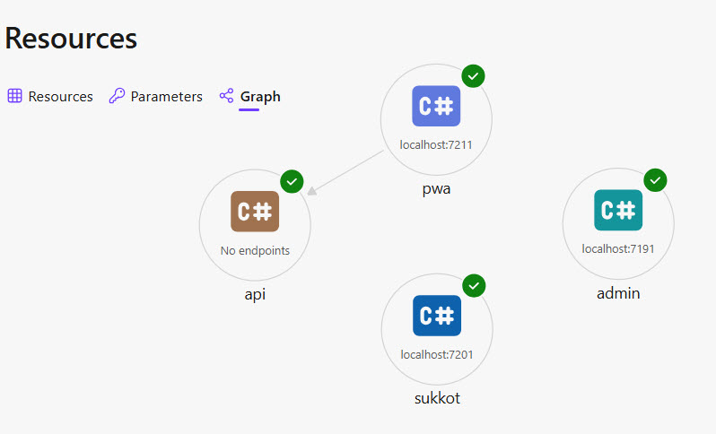

# PWA and Api Integration Documentation



## Overview

The **PWA (Progressive Web App)** project depends on the **Api** project to verify the existence of blob files in Azure Storage before displaying content links to users.

## Architecture

```
PWA.csproj (Blazor WebAssembly)
    ↓
BlobApiService (HTTP Client)
    ↓
GetBlobInfo Azure Function (Api.csproj)
    ↓
Azure Blob Storage
```

## Dependency Flow

| Component | Framework | Purpose |
|-----------|-----------|---------|
| **PWA** | Blazor WebAssembly (.NET 10) | Client-side UI that needs to verify blob existence |
| **Api** | Azure Functions Worker (.NET 8) | Backend API that checks Azure Storage for blobs |
| **Shared Models** | Defined in `Api.Models` | Request/response DTOs used by both projects |

## API Endpoint Details

### GetBlobInfo Function

**Location**: `Api/Functions/BlobInfoFunction.cs`

**Route**: `POST /api/blob-info`

**Authorization**: Anonymous (public endpoint)

**Supported Methods**: GET, POST, OPTIONS (CORS preflight)

### Request Model

```
public record BlobInfoRequest(string BlobName);
```

**Parameters**:
- `BlobName` (required): The name of the blob file to check in Azure Blob Storage

**Example**:
```
{
  "blobName": "parashas/2024/parasha-week-1.pdf"
}
```

### Response Model

```
public record BlobInfoResponse(
    bool Exists,
    BlobInfo? BlobInfo,
    string Message,
    bool IsTransient = false);

public record BlobInfo(string Name, string Url, long SizeBytes);
```

**Response Properties**:
- `Exists` (bool): Whether the blob exists in storage
- `BlobInfo` (object): Contains blob metadata if it exists:
  - `Name`: Blob file name
  - `Url`: Full URI to access the blob
  - `SizeBytes`: File size in bytes
- `Message`: Status or error message
- `IsTransient` (bool): Indicates if the error is temporary (retry-able) or permanent

**Success Response (200 OK)**:
```
{
  "exists": true,
  "blobInfo": {
    "name": "parashas/2024/parasha-week-1.pdf",
    "url": "https://[account].blob.core.windows.net/[container]/parashas/2024/parasha-week-1.pdf",
    "sizeBytes": 2048576
  },
  "message": "Blob info retrieved successfully",
  "isTransient": false
}
```

**Not Found Response (200 OK)**:
```
{
  "exists": false,
  "blobInfo": null,
  "message": "Blob 'parashas/2024/parasha-week-1.pdf' does not exist",
  "isTransient": false
}
```

**Error Response (500 Internal Server Error)**:
```
{
  "exists": false,
  "blobInfo": null,
  "message": "An error occurred while processing your request",
  "isTransient": false
}
```

## PWA Integration

### BlobApiService

**Location**: `PWA/Features/Home/Data/BlobApiService.cs`

**Purpose**: Manages HTTP calls to the `GetBlobInfo` endpoint

**Key Methods**:
- `GetParasha(Triennial? triennial, CancellationToken ct)`: Retrieves blob information for the current or specified parasha reading

### Usage Flow in PWA

1. PWA determines the current parasha reading (or accepts a specific one)
2. `BlobApiService.GetParasha()` constructs a blob file name
3. Sends a `POST` request to `/api/blob-info` with the blob name
4. Receives response and returns a `Dto` with:
   - `Url`: Link to the blob (if it exists)
   - `Parasha`: Display name for the parasha
   - `Exists`: Whether the blob is available
   - `ExceptionOccurred`: Whether an error happened

### Example Consumer

The parasha discovery features in PWA use this service to display download links only for available content.

## Configuration Requirements

### Azure Storage

The `GetBlobInfo` function requires these environment variables to be set:

| Variable | Purpose | Example |
|----------|---------|---------|
| `AzureStorageConnectionString` | Azure Storage account connection string | `DefaultEndpointsProtocol=https;AccountName=...` |
| `BlobContainerName` | Name of the blob container to query | `parashas` |

### CORS Settings

The `GetBlobInfo` function includes CORS headers to allow requests from the PWA:

```
Access-Control-Allow-Origin: https://localhost:7211
Access-Control-Allow-Methods: GET, POST, OPTIONS
Access-Control-Allow-Headers: Content-Type, Authorization
Access-Control-Max-Age: 86400
```

**Note**: The `Access-Control-Allow-Origin` is hardcoded to `https://localhost:7211`. Update this for production deployments.

## Error Handling

### Transient Errors (503, 408, 429)

These are temporary failures that clients should retry:
- **503 Service Unavailable**: Azure Storage service is temporarily down
- **408 Request Timeout**: Request took too long
- **429 Too Many Requests**: Rate limiting

**Response**: `503 Service Unavailable` with `IsTransient: true`

### Permanent Errors

Non-retryable errors that should not be retried:
- **400 Bad Request**: Missing or invalid `BlobName`
- **500 Internal Server Error**: Configuration missing or unexpected error

**Response**: Appropriate HTTP status code with `IsTransient: false`

## Development Notes

### Known Issues / TODO

1. **CORS Hardcoding**: The `Access-Control-Allow-Origin` header is hardcoded to `https://localhost:7211`. Should be configurable via environment variables for different environments.

2. **Response Model Mismatch** (⚠️ ATTENTION):
   - **PWA expects**: `BlobInfoResponse` with `CurrentReading` property
   - **Api provides**: `BlobInfoResponse` without `CurrentReading` property
   - **Status**: Needs alignment - either add `CurrentReading` to the function or remove it from the PWA model

3. **No Authentication**: The endpoint uses `AuthorizationLevel.Anonymous`. Consider adding authentication for production.

## Testing

### Local Testing

1. Ensure Azure Storage Emulator or Azure Storage account is accessible
2. Set environment variables in local.settings.json (Azure Functions)
3. Start both Api and PWA projects
4. Call the endpoint from PWA or use curl:

```
curl -X POST https://localhost:7211/api/blob-info \
  -H "Content-Type: application/json" \
  -d '{"blobName": "parashas/2024/parasha-week-1.pdf"}'
```

## Related Files

| File | Purpose |
|------|---------|
| `Api/Functions/BlobInfoFunction.cs` | Azure Function implementation |
| `Api/Models/BlobInfoRequest.cs` | Request DTO |
| `Api/Models/BlobInfoResponse.cs` | Response DTO |
| `Api/Models/BlobInfo.cs` | Blob metadata DTO |
| `PWA/Features/Home/Data/BlobApiService.cs` | Service that consumes the API |
| `PWA/Features/Home/Data/BlobApiModels.cs` | PWA-side models |

## Summary

- ✅ PWA actively uses the `GetBlobInfo` endpoint
- ✅ Function is production-ready with error handling and logging
- ⚠️ CORS origin should be configurable
- ⚠️ Response model alignment needed between API and PWA
```

This documentation provides:
- Clear architecture overview
- Detailed endpoint specifications
- Request/response examples
- Configuration requirements
- Known issues and TODOs
- Testing guidance
- File cross-references

The document is now ready to be committed to your repository!