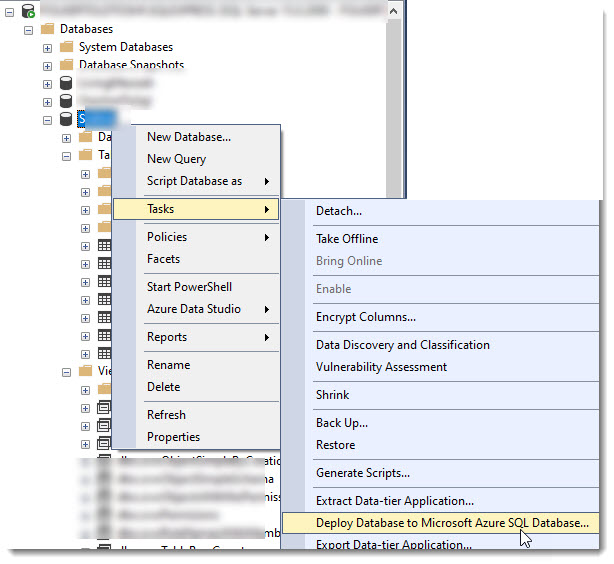
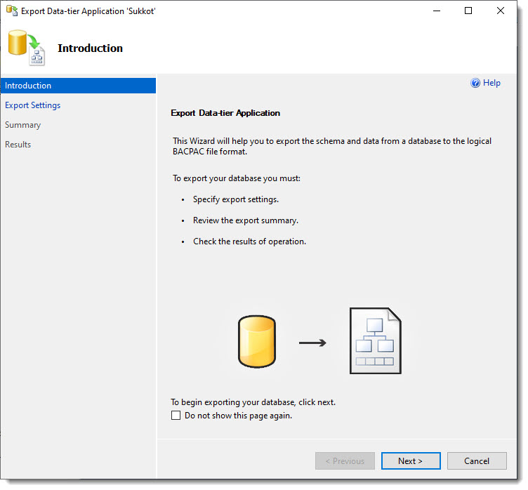
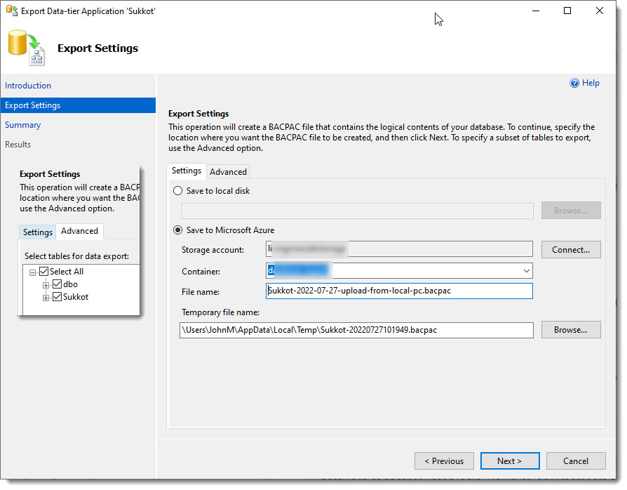
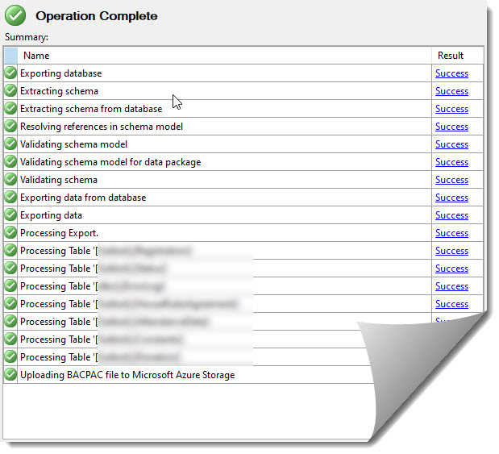
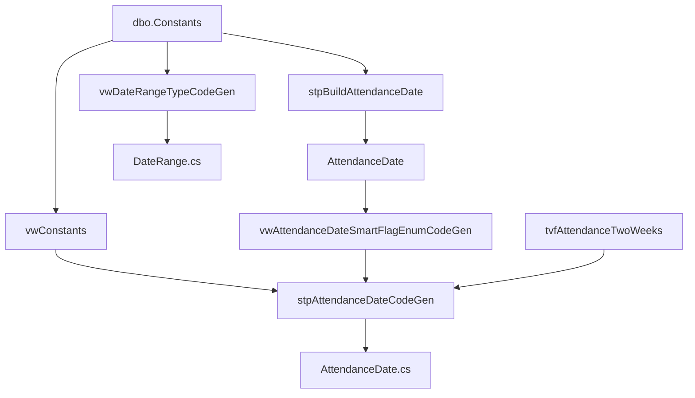

# Sukkot Annual Startup

How to open registration for a new feast year (example: **2026**).  
Tracked by [Issue #170](https://github.com/LivingMessiahJohn/LivingMessiah/issues/170).

## Goal

Users can open **Sukkot.LivingMessiah.com**, accept house rules, register, and pay.  
Admin can manage the empty-for-the-new-year registration set.

## What changes each year

| Layer | What to update |
|-------|----------------|
| SQL Server `SukkotRegistration` DB | `Constants` dates; rebuild `AttendanceDate`; clear prior-year `Donation` / `Registration` / `HouseRulesAgreement` |
| Shared C# (`RCL`) | `AttendanceDate` SmartFlagEnum; `Enums.Constants.DateRange` attendance window |
| App C# | `Sukkot.Features.Constants.Year`; `Admin.Features.Sukkot.Constants.CurrentYear` |
| Blobs / content | Banner images, schedule PDF, house-rules PDF (names in app constants) |
| Production config | Confirm app + DB deployed; smoke-test a real registration |

**Do not** change `Status` (lookup).  
`EarlyRegistrationFee` / `EarlyRegistrationLastDay` are **deprecated** — still present on `Constants`; bump year if needed but plan to remove later.

## Environments

| Env | Server / notes |
|-----|----------------|
| Local (this machine) | `JohnsDellDT\SQLEXPRESS`, database `SukkotRegistration`, files under `C:\Databases\` |
| Azure / prod | Free DB `SukkotRegistration` on `lmm-azure-sql` — run the same SQL **only after** backup and intentional open-window |

Scripts live under [`docs/sql/sukkot-annual-startup/`](sql/sukkot-annual-startup/).

## Production: backup Azure SukkotRegistration **before** annual SQL

Azure SQL has automatic point-in-time restore, but for the annual wipe you also want a **named `.bacpac`** you can find later (schema + data).

**Recommended:** SSMS → **Export Data-tier Application** while connected to the **Azure** `SukkotRegistration` database (not local `SQLEXPRESS`).

Suggested local path:

`C:\Databases\SukkotExportData\SukkotRegistration-Azure-YYYY-MM-DD-pre-annual-startup.bacpac`

### 1. SSMS menu

Right-click the **SukkotRegistration** database → **Tasks** → **Export Data-tier Application…**  
(Do **not** choose *Deploy Database to Microsoft Azure SQL Database* — that is the opposite direction.)



### 2. Export wizard intro



### 3. Export settings

- Prefer **Save to local disk** for a file under `C:\Databases\SukkotExportData\…`
- Or **Save to Microsoft Azure** (storage account + container) if you want the bacpac in blob storage  
- Keep **Select All** tables unless you intentionally exclude data



### 4. Confirm success

Finish the wizard and verify every step is **Success** (file size &gt; 0).



### After the bacpac

1. Note **UTC time** (Azure PITR safety net).  
2. Optional: row counts on Azure (`Donation` / `Registration` / `HouseRulesAgreement`).  
3. Then run production SQL: `01` → `02` → `03` (see scripts folder).

## Ordered process

```text
0. Backup Azure SukkotRegistration (.bacpac) — see section above
1. Decide dates (align with FeastDayDates.Tabernacles)
2. UPDATE dbo.Constants
3. EXEC dbo.stpBuildAttendanceDate
4. DELETE prior-year rows (Donation → Registration → HouseRulesAgreement)
5. CodeGen → paste into RCL SmartEnums / DateRange
6. Bump Year / CurrentYear in app projects
7. Optional: documents, banners, T-shirt blob names
8. Build, local smoke, deploy, prod smoke
```

### Step 1 — Decide the attendance window

Source of truth for the feast day: `RCL/Features/Calendar/Constants/FeastDayDates.cs` → `Tabernacles`.

Historical pattern used by Living Messiah:

| Concept | Formula | 2026 example (`Tabernacles` = 2026-09-26) |
|---------|---------|-------------------------------------------|
| Attendance min (prep / camp setup) | `Tabernacles − 1 day` | **2026-09-25** |
| Attendance max (tear-down) | `Tabernacles + 8 days` | **2026-10-04** |
| Registration last day | Business choice (must be ≤ attendance min) | **2026-09-15** |
| Fees | Keep `$100` family / `$50` single unless leadership changes them | unchanged |

Attendance is always **10 consecutive days** (bitwise flags `1…512`).

### Step 2 — Update `dbo.Constants`

```sql
-- See docs/sql/sukkot-annual-startup/01-Update-Constants.sql
UPDATE dbo.Constants
SET EarlyRegistrationFee = 100.0
  , EarlyRegistrationLastDay = '2026-09-15'
  , RegistrationFee = 100.0
  , RegistrationLastDay = '2026-09-15'
  , AttendanceMinDate = '2026-09-25'
  , AttendanceMaxDate = '2026-10-04';
```

**Verify**

```sql
SELECT * FROM dbo.vwConstants;
```

Expect:

| Field | 2026 |
|-------|------|
| `RegistrationLastDay` | 2026-09-15 |
| `AttendanceMinDateMDY` | 09/25/2026 |
| `AttendanceMaxDateMDY` | 10/04/2026 |
| `RegistrationFee` / `RegistrationFeeSingle` | 100 / 50 |

`vwConstants` also derives week boundaries used by CodeGen (`FirstWeekStartDate`, …).

### Step 3 — Rebuild `AttendanceDate`

```sql
-- See docs/sql/sukkot-annual-startup/02-Build-AttendanceDate.sql
EXEC dbo.stpBuildAttendanceDate;
SELECT Id, [Date], [Value] FROM dbo.AttendanceDate ORDER BY Id;
```

**Expected metrics (printed by the SP):**

- Deletes previous rows (usually 10)
- Inserts 10 rows: Id 1–10, `Value` = powers of two (1…512)
- Dates = each day from min → max inclusive

`stpBuildAttendanceDate` reads only `Constants.AttendanceMinDate` / `AttendanceMaxDate` and uses `dbo.Numbers`.

### Step 4 — Clear prior-year registration data

**FK order is mandatory** (`Donation` → `Registration` → `HouseRulesAgreement`):

```sql
-- See docs/sql/sukkot-annual-startup/03-Delete-Prior-Year-Registrations.sql
DELETE FROM dbo.Donation;
DELETE FROM dbo.Registration;
DELETE FROM dbo.HouseRulesAgreement;
```

**Metrics:** record `@@ROWCOUNT` after each delete (script prints them).

Notes:

- `dbo.stpHouseRulesAgreementDelete` deletes **one email** (Donation → Registration → HRA). Useful for ad-hoc cleanup, not the full annual wipe.
- Local dev often only has test rows; **production** wipe is irreversible — backup first.
- Do **not** truncate `Status` or `Constants`.

### Step 5 — CodeGen → C# SmartEnums

After steps 2–3, generate C# fragments and paste into RCL.

#### 5a. Attendance date range (`DateRange.cs`)

```sql
SELECT DateRangeCodeGen FROM dbo.vwDateRangeTypeCodeGen;
```

Update:

- `RCL/Features/Sukkot/Enums/Constants/DateRange.cs` → `Attendance.Start` / `Attendance.Finish`
- `DateRangeType` already reads those constants; no need to paste the old `DateRangeCodeGen` line into the SmartEnum if `DateRange.cs` is the single source.

#### 5b. `AttendanceDate` SmartFlagEnum

```sql
EXEC dbo.stpAttendanceDateCodeGen;
-- Also useful:
SELECT * FROM dbo.vwAttendanceDateSmartFlagEnumCodeGen ORDER BY Id;
```

Paste into `RCL/Features/Sukkot/Enums/AttendanceDate.cs`:

| Result set | Goes into |
|------------|-----------|
| `RegionId` | `BitwiseId` constants |
| `CodeGenDeclPubInst` | public static instances |
| `CodeGenInstantiation` | private `*_SE` classes (`Title`, `Date`, `Week`, …) |

Also set `Day` to the calendar day-of-month (not emitted by all CodeGen paths).

#### SQL objects involved



### Step 6 — Year constants in apps

| File | Purpose |
|------|---------|
| `Sukkot/Features/Constants/Year.cs` | Public site title / print / agreement year |
| `Admin/Features/Sukkot/Constants/CurrentYear.cs` | Admin verbiage / year display |

Set both to the feast year (e.g. `2026`).

### Step 7 — Content / blobs (optional same PR)

| Constant | Typical blob name pattern |
|----------|---------------------------|
| `Sukkot/.../Banner.Img` | `YYYY-sukkot-banner-….jpg` on `images/events/` |
| `BannerWide.Img` | `sukkot-YYYY-….jpg` |
| `Documents.PDFs.Schedule` / `HouseRules` | `sukkot-YYYY-….pdf` on `pdfs/` |
| T-shirt image | `sukkot-YYYY-tee-shirts.jpg` |

Upload new blobs to Azure Storage **before** renaming constants in production, or keep last-year PDFs until ready.

### Step 8 — Verify & ship

1. `dotnet build LivingMessiah.sln` (or at least `RCL`, `Sukkot`, `Admin`)
2. Local: run AppHost or Sukkot; walk agreement → registration form → attendance checkboxes match new dates
3. Admin: registration list empty (after wipe); create a test reg if desired
4. PR with `Fixes #170` (or the current issue); human merge/deploy per [`SHIP-WORKFLOW.md`](SHIP-WORKFLOW.md)
5. Production: run the same SQL on Azure **after** backup; smoke-test register + Stripe path

## Metrics checklist (fill when you run it)

| Step | Action | Expected / actual |
|------|--------|-------------------|
| Constants | `UPDATE` | 1 row |
| AttendanceDate | delete / insert | 10 / 10 |
| Donation | delete | _n_ |
| Registration | delete | _n_ |
| HouseRulesAgreement | delete | _n_ |
| CodeGen | paste + build | green |

## Master SP vs CLI (future)

Options considered for later automation:

1. **`stpSukkotAnnualStartup`** — master SP calling update / build / delete, returning a metrics result set  
2. **.NET CLI + Spectre.Console** — interactive menus, dry-run, env switch, write CodeGen files to disk  

Prefer a **CLI** if you want dry-run + file write; prefer a **master SP** if ops always run from SSMS. Not required to open registration if the scripts above are run carefully.

## Out of scope for a typical open

- Changing Stripe product IDs / Auth0 apps  
- Rewriting registration UI  
- Post-Sukkot contact harvest (see wiki shutdown notes)  
- Deleting Azure production data without an explicit backup + go-ahead  

## Related paths in this solution

| Path | Role |
|------|------|
| `RCL/Features/Sukkot/Enums/AttendanceDate.cs` | Bitwise attendance days |
| `RCL/Features/Sukkot/Enums/Constants/DateRange.cs` | Min/max dates for UI |
| `RCL/Features/Sukkot/Enums/DateRangeType.cs` | SmartEnum over `DateRange` |
| `RCL/Features/Calendar/Constants/FeastDayDates.cs` | Feast calendar (align attendance) |
| `Sukkot/Features/Constants/Year.cs` | Public year label |
| `Admin/Features/Sukkot/Constants/CurrentYear.cs` | Admin year label |
| `Sukkot/Features/Data/Repository.cs` | HRA / registration / donation SQL |

## Naming conventions (Sukkot schema)

| Kind | Prefix / suffix |
|------|-----------------|
| Tables | none (`Constants`, `Registration`, …) |
| Stored procedures | `stp…` |
| Views | `vw…` |
| Table-valued functions | `tvf…` |
| CodeGen objects | name ends in `CodeGen` |
| CRUD SPs | action suffix (`…Delete`, `…Insert`) |

## 2026 run (local)

Dates chosen from `FeastDayDates.Tabernacles = 2026-09-26`:

| Setting | Value |
|---------|-------|
| Attendance | 2026-09-25 → 2026-10-04 |
| Registration last day | 2026-09-15 |
| Year constants | 2026 |

### Local metrics (2026 open)

| Step | Result |
|------|--------|
| Constants `UPDATE` | 1 row |
| AttendanceDate delete / insert | 10 / 10 |
| Donation delete | 2 |
| Registration delete | 2 |
| HouseRulesAgreement delete | 3 |

### CodeGen caveat (non-Sunday start)

`stpAttendanceDateCodeGen` joins `tvfAttendanceTwoWeeks` using calendar weeks of min/max dates. When `AttendanceMinDate` is not Sunday, those two weeks can leave a gap and omit mid-range days from the instantiation result set. For 2026, build all 10 `*_SE` classes from `vwAttendanceDateSmartFlagEnumCodeGen` and set `Week` as first 7 days = 1, remaining = 2. The registration form currently uses a single date range (`HasSecondMonth == false`), so `Week` is secondary.

Scripts: [`docs/sql/sukkot-annual-startup/`](sql/sukkot-annual-startup/).
